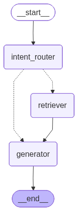

# SHL Assessment Recommender

This project features a conversational AI agent designed to help hiring managers and recruiters navigate the SHL product catalog to find the most suitable Individual Test Solutions for their hiring needs.

## Problem Statement
Hiring managers often have a vague idea of the role they are hiring for (e.g., "I am hiring a Java developer") but may not be familiar with the specific vocabulary required for keyword-based searches in assessment catalogs. This makes the selection process slow and shallow. The **Assessment Recommender** bridges this gap through a guided dialogue that clarifies intent and provides grounded recommendations.

## Core Features
- **Conversational Interface:** Moves from vague intent to a grounded shortlist of assessments through natural dialogue.
- **Intelligent Clarification:** Asks for missing details like seniority or specific role requirements before making recommendations.
- **Comparison Support:** Enables users to compare different assessments within the catalog.
- **Strict Guardrails:** Only recommends assessments from the authorized SHL Individual Test Solutions catalog.

## Technical Architecture
The system utilizes an agentic workflow built with **LangGraph**, composed of three primary nodes:

  

1.  **Intent Router Node:** Analyzes user queries for sufficient detail. It decides whether to ask for more information or proceed to the search phase.
2.  **Retriever Node:** Executes semantic searches against a **FAISS vector database** containing the SHL product catalog.
3.  **Generator Node:** Synthesizes retrieved data and conversation history into a professional response, often presented in a structured table format with advisory notes.

## Tech Stack
- **LLM Model:** `gemini-3.1-flash-lite`
- **Embedding Model:** `all-MiniLM-L6-v2`
- **Orchestration:** LangGraph
- **Vector Database:** FAISS (stored locally as `shl_faiss_index`)
- **Language:** Python
- **Backend Framework:** FastAPI
- **Frontend:** HTML, CSS, JavaScript
- **Version Control:** Git
- **Containerization:** Docker
- **Deployment:** Hugging Face Spaces

## Live Demo
You can access the live application here: [SHL Assessment Recommender on Hugging Face](https://deemis7-shl-assessment-recommender-agent.hf.space/)

## Development

- **Author:** Deepak Mishra
